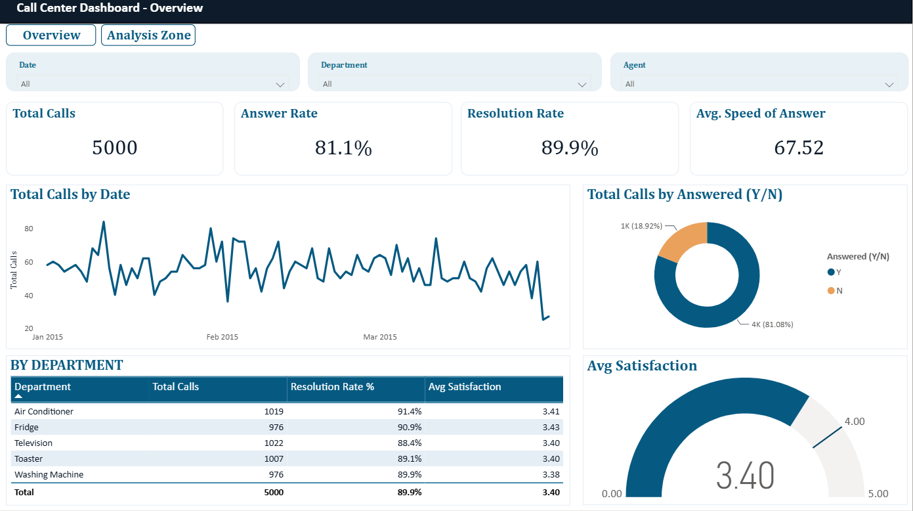
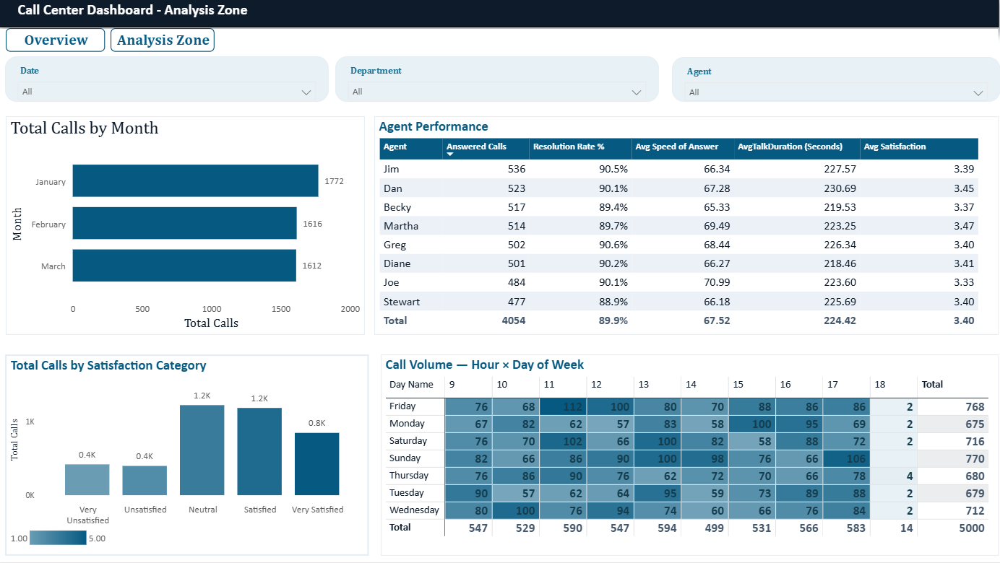

# 📞 Call Center Performance Dashboard

A Power BI project analyzing 5,000 call center records (Jan–Mar 2015) to evaluate operational efficiency, agent performance, and customer satisfaction — and to identify what actually drives (and doesn't drive) satisfaction.



---

## 📌 Project Overview

| | |
|---|---|
| **Dataset** | 5,000 call records — Jan 1 to Mar 31, 2015 |
| **Agents** | 8 |
| **Departments** | 5 (Washing Machine, Air Conditioner, Toaster, Fridge, Television) |
| **Tools** | Power BI Desktop (Power Query, DAX, Data Modeling) |
| **Pages** | Overview · Analysis Zone |

The goal was not just to build charts, but to follow a full analytics workflow: define business questions and KPIs first, explore the data, clean and shape it, build the model, then design a dashboard that actually answers the original questions — no more, no less.

---

## 🗂️ Workflow

1. **Business Questions & KPIs** — defined upfront across four areas: Operational Efficiency, Agent Performance, Customer Satisfaction, Time Analysis.
2. **EDA** — quick profiling in Python to understand structure, nulls, and ranges before touching Power Query.
3. **Power Query (ETL)** — see below.
4. **Data Model & DAX** — see below.
5. **Dashboard Build** — two pages, described below.
6. **Insights & Recommendations** — see below.

---

## 🧹 Data Cleaning (Power Query)

- Imported the source Excel table (not the raw sheet) to avoid picking up stray out-of-range data.
- Corrected data types for every column; confirmed `Speed of Answer` is a plain numeric field (seconds) and should **not** be converted to a Duration type, since it isn't stored as a time value.
- Fixed `AvgTalkDuration`, which Power BI read as a Time value with sub-second artifacts inherited from the source file. Converted it to a proper `Duration` type while **preserving nulls** for the 946 unanswered calls — these calls have no talk duration by definition, so they were kept as blanks rather than zeroed out, to avoid skewing any average.
- Split the original `Date` column into a clean **Date** and **Call Time** column, and normalized the time to the minute (the source file itself displayed no seconds — the sub-minute noise was a floating-point artifact, not real data).
- Added **Hour** and **Day Name** columns to support time-of-day and day-of-week analysis.
- Added an `AvgTalkDuration (Seconds)` column (`Duration × 86400`) so talk duration and speed of answer share the same unit for any comparison.

---

## 🧮 Data Model & DAX

All measures live in a dedicated `_Measures` table (kept separate from the data table for clarity — measures don't require a relationship to work across tables).

**Core measures:**
```dax
Total Calls = COUNTROWS('Call Center Data')

Answered Calls = CALCULATE([Total Calls], 'Call Center Data'[Answered (Y/N)] = "Y")
Answer Rate % = DIVIDE([Answered Calls], [Total Calls])

Resolved Calls = CALCULATE([Answered Calls], 'Call Center Data'[Resolved] = "Y")
Resolution Rate % = DIVIDE([Resolved Calls], [Answered Calls])

Avg Speed of Answer = AVERAGE('Call Center Data'[Speed of Answer])
Avg Talk Duration (Seconds) = AVERAGE('Call Center Data'[AvgTalkDuration Seconds])
Avg Satisfaction = AVERAGE('Call Center Data'[Satisfaction rating])

Avg Satisfaction (Resolved) = CALCULATE([Avg Satisfaction], 'Call Center Data'[Resolved] = "Y")
Avg Satisfaction (Unresolved) = CALCULATE([Avg Satisfaction], 'Call Center Data'[Resolved] = "N")
Satisfaction Gap = [Avg Satisfaction (Resolved)] - [Avg Satisfaction (Unresolved)]

Unanswered Rate % = 1 - [Answer Rate %]
```

**Calculated column** (categorizes each rating for distribution analysis, with a manual sort order applied so categories read Very Unsatisfied → Very Satisfied instead of alphabetically):
```dax
Satisfaction Category =
SWITCH(
    'Call Center Data'[Satisfaction rating],
    1, "Very Unsatisfied",
    2, "Unsatisfied",
    3, "Neutral",
    4, "Satisfied",
    5, "Very Satisfied",
    BLANK()
)
```

---

## 📊 Dashboard Pages

**Overview** — the executive snapshot: total calls, answer rate, resolution rate, average satisfaction, the daily call trend across Jan–Mar, the answered/unanswered split, and a department-level breakdown.


**Analysis Zone** — the deeper dive: agent-level performance (calls, resolution rate, speed, talk duration, satisfaction), monthly call volume, the satisfaction rating distribution, and an hour-by-day-of-week call volume heatmap for identifying peak times.



Both pages share the same slicers (Date, Department, Agent) and a consistent visual identity.

---

## 💡 Key Insights

1. **January was both the busiest and the most-satisfying month** — 1,772 calls (the highest volume of the quarter) with the highest average satisfaction (3.45/5), while February and March each ran lower on both. This suggests the team handled peak load without a drop in service quality.
2. **Agent performance is consistent across the board** — resolution rate (88.9%–90.6%), speed of answer (65–71s), and talk duration are all close together across the 8 agents. No single agent stands out as a clear underperformer.
3. **Satisfaction sits around 3.3–3.47/5 despite solid operational metrics** — since the operational side (speed, resolution, consistency) looks healthy, the gap is more likely coming from something outside the call itself (product, pricing, policy) rather than how the call was handled.
4. **Resolving the issue has almost no measurable effect on satisfaction** (Satisfaction Gap ≈ **-0.03** between resolved and unresolved calls). This challenges the common assumption that "resolved = satisfied."
5. **Speed of answer has virtually no correlation with satisfaction** (≈0.001 across all 4,054 answered calls) — faster response alone is not a lever for improving satisfaction.
6. **18.9% of all calls (946 of 5,000) were never answered** — a real operational gap, independent of how well the answered calls were handled.
7. **Fridays and Sundays see the highest call volumes** (768 and 770 respectively) — useful for staffing decisions.

*(Validation note: heatmap totals per weekday were checked across all 13 occurrences of each day — the pattern is consistent, not driven by a single outlier day.)*

---

## 🔍 A Working Hypothesis (not confirmed by the data)

Every operational metric in this dataset looks healthy — resolution rate, answer speed, talk duration, and agent consistency are all solid. The one metric that stands out as comparatively weak is **average satisfaction (3.40/5)**. This mismatch, combined with the fact that **18.9% of calls were never answered**, suggests a plausible explanation: some of those unanswered customers likely called back later (people who call a support line usually have a real request behind it), and that friction — not the quality of the eventual conversation — may be part of what's pulling satisfaction down.

**This can't be confirmed with the current data** — there's no customer identifier linking one call to another, so it's impossible to trace repeat contact from the same person. It's a reasonable hypothesis worth testing, not a conclusion. If customer-level tracking becomes available, this would be the first thing worth investigating.

---

## ✅ Recommendations

1. **Look beyond the call center for the satisfaction gap** — since call handling metrics are strong, investigate product, pricing, or policy factors that may be driving the moderate satisfaction scores.
2. **Reallocate staffing toward peak times** (Fridays, Sundays, and the 11 AM–12 PM window) to reduce the 18.9% unanswered rate.
3. **Increase overall staffing capacity** if the unanswered rate persists after re-scheduling — 18.9% is a meaningful volume of missed contact regardless of when it happens.
4. **Don't prioritize reducing answer speed as a satisfaction strategy** — the data shows no meaningful relationship, so that investment is better spent elsewhere.
5. **Add a customer identifier to future data collection** — this would make it possible to test the repeat-contact hypothesis above and connect satisfaction scores to specific customer journeys.

---

## 🛠️ Tools Used

Power BI · Power Query (M) · DAX

---

## 🛠️ How to Use

1. Download `Call-Center-Dataset.xlsx` and `Call Center Dashboard.pbix`.
2. Open the `.pbix` file in Power BI Desktop.
3. Refresh the data source path if needed (Transform Data → Data source settings).

---

## 👤 Author

Hesham — Finance graduate and Data Analyst, currently in the Digital Egypt Builders Initiative (DEBI) program.
